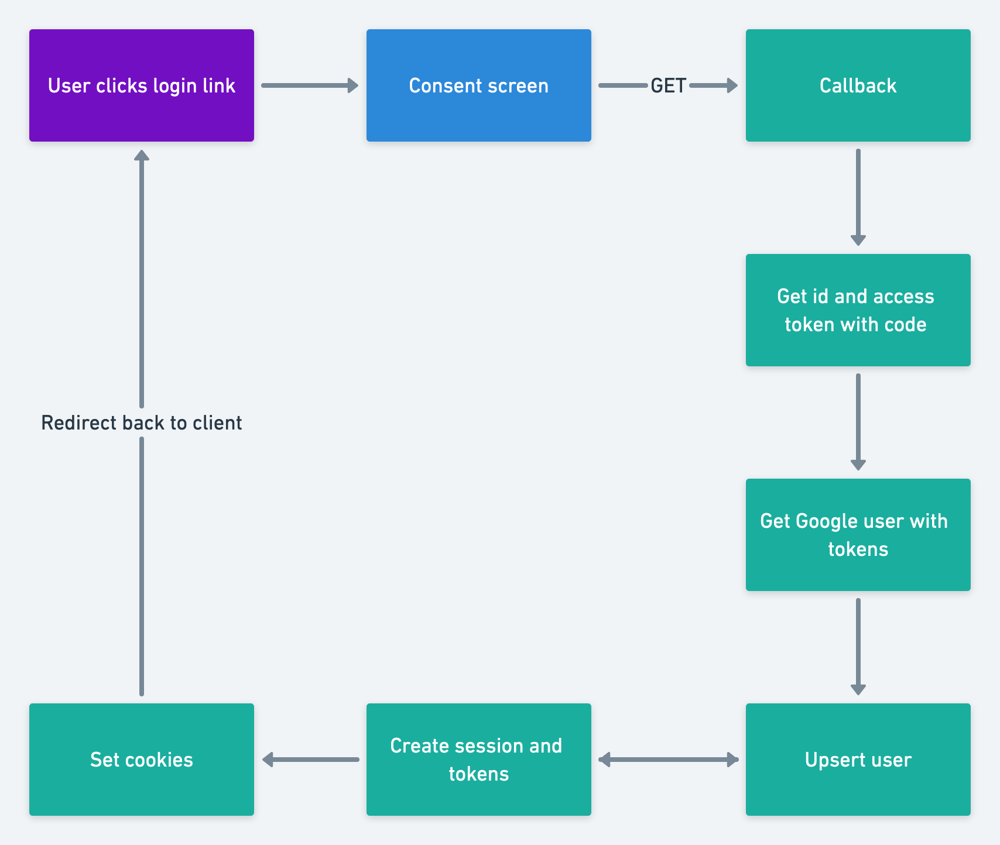

# Google Oauth

## What will I lean?
* How to get Google OAuth API keys
* How OAuth works
* How to build an OAuth implementation with Node.js

## What will we not be using?
* Passport
* googleapis npm package

## Let's keep in touch
- [Subscribe on YouTube](https://www.youtube.com/TomDoesTech)
- [Discord](https://discord.gg/4ae2Esm6P7)
- [Twitter](https://twitter.com/tomdoes_tech)
- [TikTok](https://www.tiktok.com/@tomdoestech)
- [Facebook](https://www.facebook.com/tomdoestech)
- [Instagram](https://www.instagram.com/tomdoestech)

[Buy me a Coffee](https://www.buymeacoffee.com/tomn)

[Sign up to DigitalOcean 💖](https://m.do.co/c/1b74cb8c56f4)
